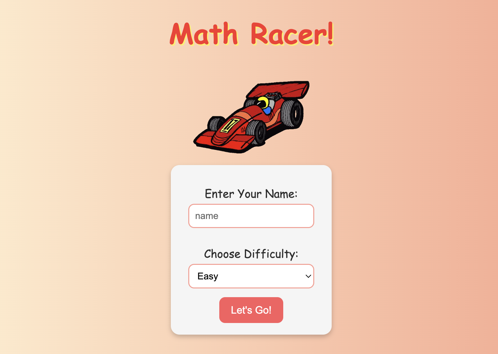
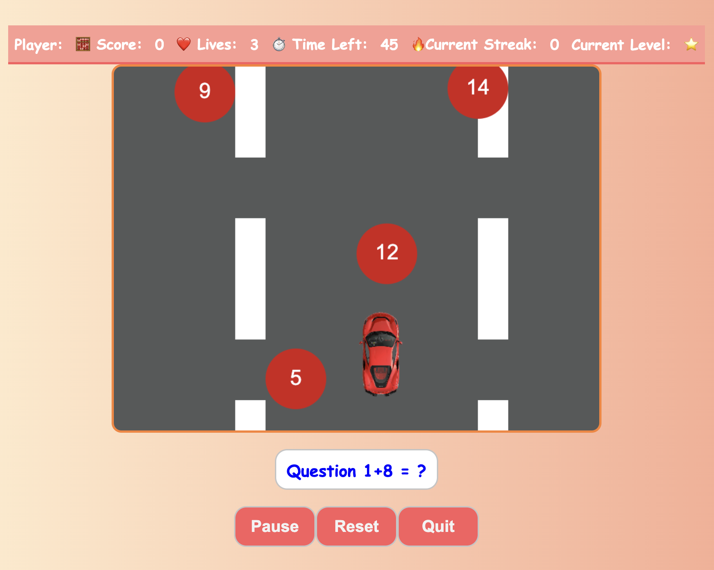
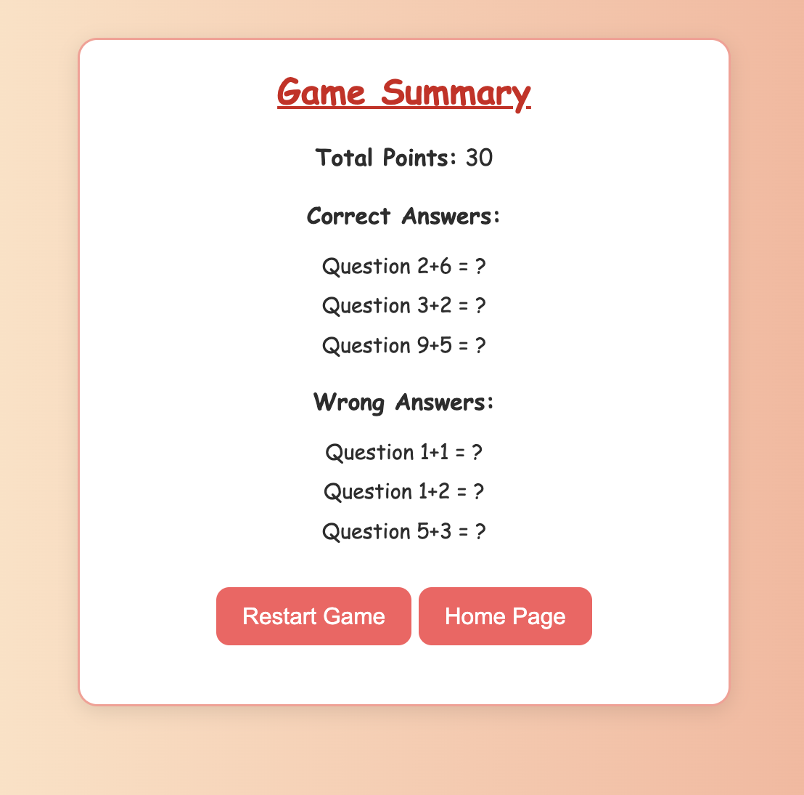

# 🏎️ Math Racer 🧮  
An interactive math game designed to make learning fun for preschoolers! Players race to solve math problems by steering a car into falling answer balls. The game adapts to different difficulty levels and tracks performance in real-time.

---

## 🎮 Screenshots  
### Landing Page  

### Gameplay  

### Summary Page  

---

## 🛠️ Technologies Used  
- HTML5  
- CSS3  
- JavaScript (Vanilla)  
- Canvas API  

---

## 🚀 Getting Started  
Play the game here 👉 Launch Math Racer

---

## 🧩 Game Flow

### Landing Page
- Player enters their name.
- Selects difficulty: Easy, Medium, or Hard.
- Clicks “Let’s Go” to proceed.

### Instructions Page
- Brief overview of how to play.
- Click “Start Game” to begin.

### Game Page
- Math questions appear.
- Four answer balls fall from the top.
- Player steers the car to catch the correct answer.

### Summary Page
- Displays score, correct/incorrect answers.
- Option to restart or return to home.

---

## 👨‍👩‍👧‍👦 Why This Matters
Math Racer aims to make early math learning **fun, engaging, and effective** — giving children a head start in STEM.

---

## 🛝 Slides
Presentation Material: [Google Slides](https://docs.google.com/presentation/d/1CXNNa-oaXDKpWTAunvy_ny7_6mk3vcfExLqoK8c8Sso/edit?usp=sharing).

---

## 📈 Flowchart

---

Happy Racing! 🏁
